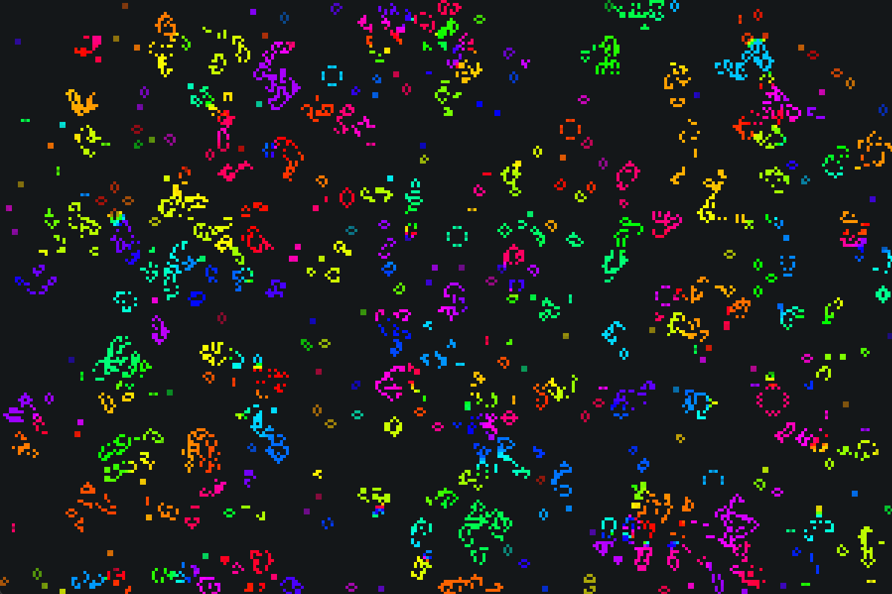

### Game Of Life mit erweitertem State (z.B: Hue, Age, ...)

* Unter Windows & Linux (Ubuntu) getestet.
* Nicht MacOS-Kompatibel, weil die OpenGL ab Version 4.1 deprecated haben und Compute Shader nunmal 4.3 benötigen.

```
cmake -S . -B build
cmake --build build
```

mehr Dokumentation, sobald jemand danach fragt (:

### Beispiel für ein 300x200-Feld

